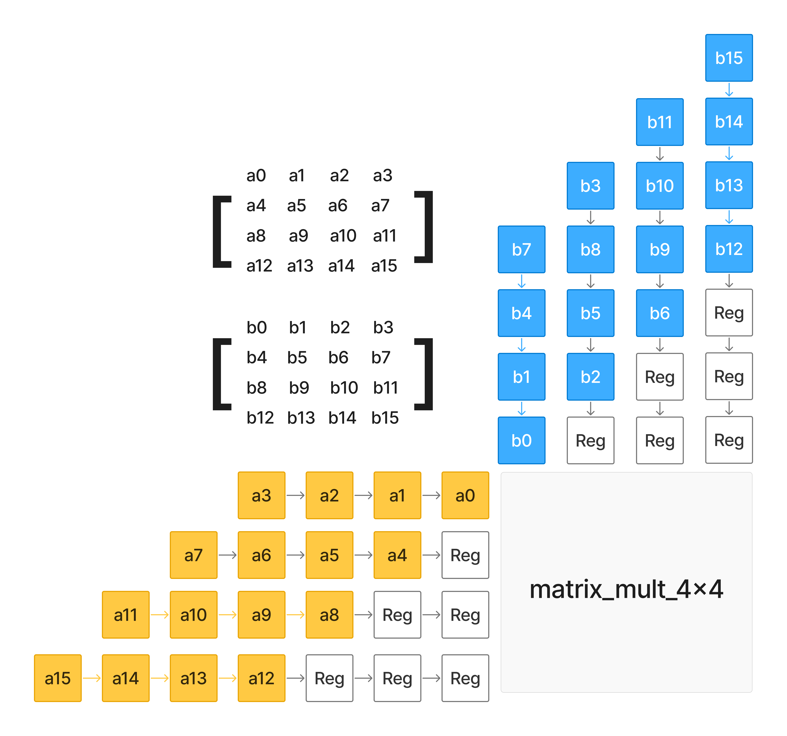
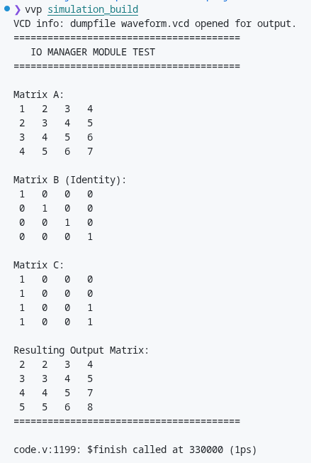
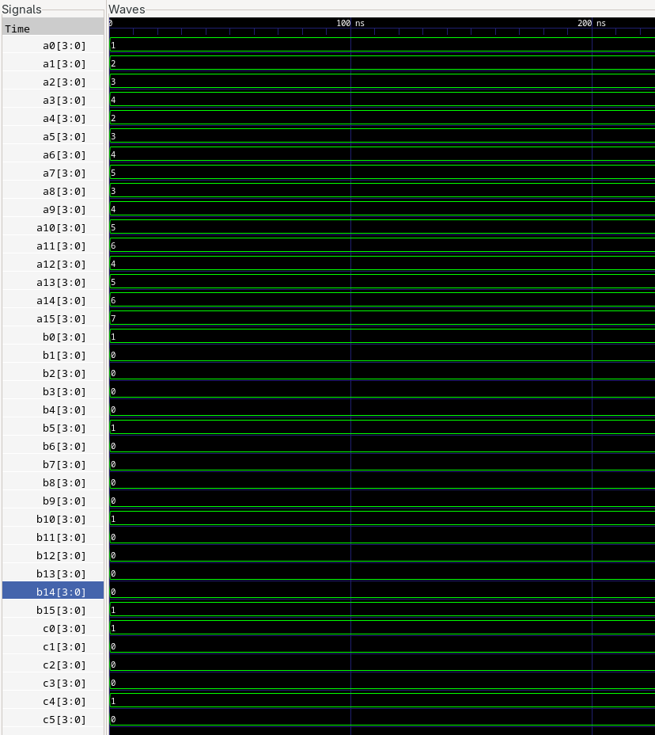
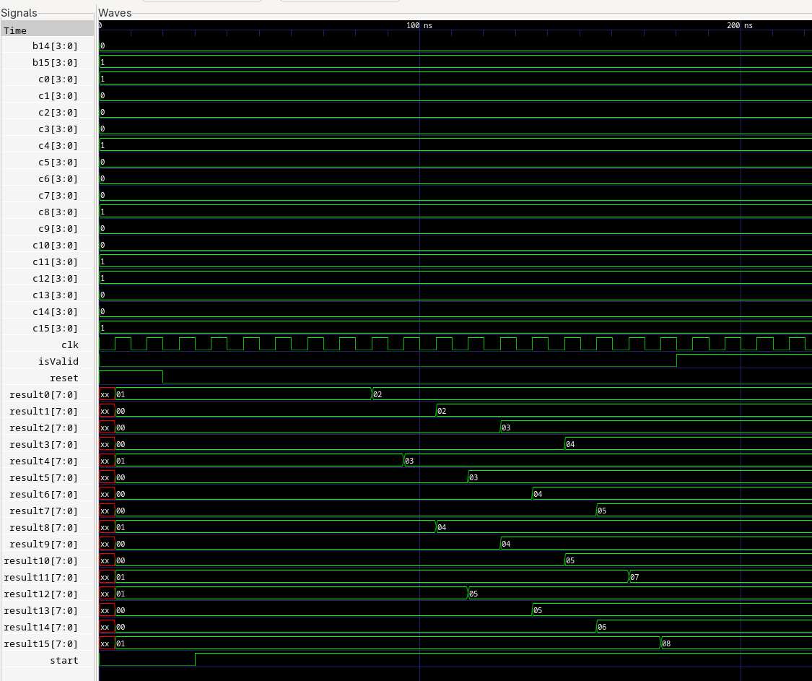

# Simple Tensor Core Implementation in Verilog

**Mohammad Mahmoodi - 40435605**

## Abstract
This project features designing and building a simple version of "Tensor Core" hardware circuit from scratch using Verilog language, a component that is a vastly used for training Artificial intelligence models in deep learning. This project features a short dive into what is 'under the hood' of the hardware component that is used to run and train AI models everyday and reveals how they are designed and built and how they work.

## Introduction
Matrix operations such as multiplication and addition happen millions of times when using or training artificial intelligence models. Normally, these operations are done by CPU or GPU. CPU & GPU are more like 'a jack of all trades', they are designed for general purpose usage to solve a vast variety of different problems, they are good at doing every task but master of none. Hence, designing a hardware model that is designed specifically for calculating matrix operations, will result in a much faster circuit that is perfect for training AI models. "Tensor Core" is such a circuit. While CPU needs to fetch memory thousands of times to do giant matrix multiplications which will result in pressure on memory and more delays due to timings, Tensor core uses systolic arrays to fetch the data once and pump it through the network of processing elements and use it thousands of times without fetching the memory again. This results in much less pressure on the memory and less delay. This project features building a simple tensor core from scratch, using Verilog HDL.

## Methodology

### Layer One: Adders and Multiplicator
- **Bit Size Decision:** We expect input matrices to have elements that are 4-bit wide. The system outputs a matrix that is 8-bit wide. That means the system has a limit with the numbers, if given numbers that are too big, overflow might occur which results in wrong results, hence when entering input, this 8-bit bottleneck should be considered. By calculations at the Appendix.1, if we want to get absolute correct results every time no matter how big our numbers are, we need to increase this 8-bit number size in the final matrix to 11-bits, which is further than the goal of this project and the project did not ask for it, hence I did not go for it. The design sticks to the 8-bit size results that was requested.

- **Modules in this layer**: 4-bit carry-look-ahead adder for faster calculations, one 8-bit adder made up using two 4-bit carry-look-ahead adders, the 8-bit adder is used in the multiplicator module and the tensor module(to add matrices) a 4x4 multiplicator which multiplies two 4-bit numbers and outputs an 8-bit wide number as the result.

### Layer Two: Systolic Array & Multiplication
- **Processing Elements (PE):**
  - **The need:** Each processing unit must be able to hold the value of current sum between different stages, to be used for calculation. This sum needs to be updated after each calculation and the new value should be passed for the next stage.
  - **The approach:** The requirement above describes a need to an independent memory, hence a register is built into the processing unit to provide the ability to save the value of the current sum, access it for calculation, pass it between different stages and update it when needed.
  - **Overall Functionality:** The unit receives data at the pos-edge, the current value of sum is read and the new value of sum is calculated and will be saved at the next pos-edge. When there is no data to pass, the unit will be fed with zero, so the value of the sum in register remains the same.
- **Systolic Array/Network**
  - **The need:** The network of systolic array, must be fed with staggered data, that is, different parts of the data need to land at the network at different times, to ensure the calculation is done correctly.
  - **The approach:** Inputs of the systolic network, which are located at above and left of the network, are connected to shift registers with synchronous reset. When there is no data, the register value holds zero. When start signal is received, we feed the shift registers with matrix elements. Due to different length, each data lands at the matrix_mult network at a different proper time.

  

  - **The need:** When a processing unit receives a data at a clock cycle(current stage), the processing unit below it and on its right must receive the same data in the next clock cycle(in the next stage).
  - **The approach:** Each PE module is implemented with two built-in registers. They receive the data from the processing unit, and their output is connected to the corresponding next processing unit. When the new data arrives at the PE, the register also receives the data, but the next processing units can see this new data that comes out of the register, after one clock cycle, ensuring stage-by-stage calculation.
  
  

- **Overall Functionality:** To really achieve staggering of data, an internal state is determined named `cycle_count`. It determines which stage we are in, therefore we know which data we have to push to each shift register at this exact moment. The cycle loads the data into registers in four stages(four clock cycles) and when the last wave data is put onto the wires, it asserts the signal `isFinished` which means no further data will be sent to shift registers(Note that, the circuit is designed so when we do not have any data, we pass zeros, which will not change the value of sum in PE, and does not result in high-impedance). Note that `isFinished` does not mean the calculation is finished, it only means all the data is loaded into the system.

- **"start" signal:** The stages above progress only if `start` signal is asserted and `isFinished` signal is low. Before we assert start, assuming `reset` signal had been active in the past for at least one clock cycle, all values that flow into the system are zero, hence no change will occur on the summation value that each PT holds. The process will only start when we asserted `start` and keep it active, and once the process of loading the data ends and `isFinished` is active, regardless of the value of `start`, no further data is sent to the system but zeros, which have no effect on the summation value inside PE.

### Layer Three: Tensor module

The "systolic_array" module multiplies two matrices that have 4-bit wide elements and output a result matrix that has 8-bit wide elements. These 8-bit elements are added with corresponding elements of the $C$ matrix using 8-bit adders. That means each output signal from "systolic_array" is sent through an adder to derive the final matrix.

### Layer Four: IO Manger

- **Functionality:** It receives 16 signals for each of the three matrices to receive the elements of those matrices. Each signal is 4-bits wide. Then it outputs the resulting matrix $D = A × B + C$ in 16 signals, each four bits wide.

- **"isValid" signal** 
  - **Purpose:** As it takes time for the circuit to derive the final matrix and put it on the output wires, the signal `isValid` is low when the result is completely calculated, and will be asserted when the result is finally driven and valid. 
  - **How it works:** After `isFinished` signal is asserted and no further data is loaded into shift registers, it takes 11 clock cycles for the result to be completely calculated. This happens on a positive clock edge, hence if we want to read the output at the beginning of a clock edge, we have to wait 11 and half clock cycles.

## Test & Analyze

A simple test were conducted to see how the circuit calculates the equation $A × B + C$:

*Console results

*Waveform diagrams

At first, `reset` signal was asserted and remained active two clock cycles, to set all "undefined values" to zeros, so we can start the process. At the same time, the data, which was the matrices A & B & C, were put on the wires. One clock cycle after `reset` was set back to zero, `start` signal was asserted. The circuit started to put the data on the shift registers and finished this process after four cycles, and `isFinished` became active. 11 cycles after `isFinished` signal became active, the output became ready and valid, hence `isValid` became active at the beginning of the next clock cycle.

## Conclusion

This project is a clear example of the fact that more complexity is not always the best solution, and sometimes simple blocks that are built using simple theories can be more efficient and faster for a specific usage. Sometimes the goal is not to add more features, but is making the component more simple to unlock more efficiency, and have a component that is perfect and efficient for a specific usage. How tensor core is designed and how it operates is much more simple compared to a CPU, but it does matrix multiplication much faster.

## Appendix

### 1. Bitsize Decisions: Elements in Final Matrix Must Be 11-bits Wide
The input matrix must be consisted of 16 4-bit length numbers. When multiplying these matrices, each new element in the result matrix will be constructed by summation of four terms where each term is the result of multiplication of two 4-bit length numbers. ‌Each number is $15$ at maximum, their multiplication is $15 * 15 = 255$ at maximum and hence the final number will be $4 * 255 = 1020$ at maximum, and when added with another matrix, it will be $1020+15=1035$ at maximum, hence we need 11 bits to store all values properly.

$$2^{11} = 2048 > 1035 > 2^{10} = 1024$$

Otherwise, The circuit works properly for small numbers and when encountering large numbers, our results become inaccurate due to overflow.